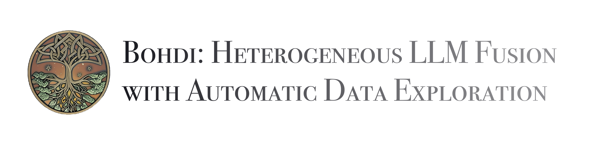
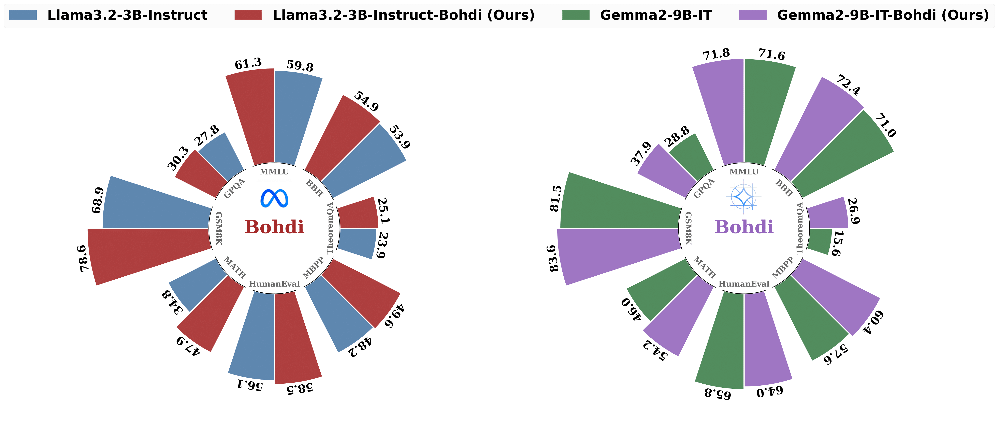
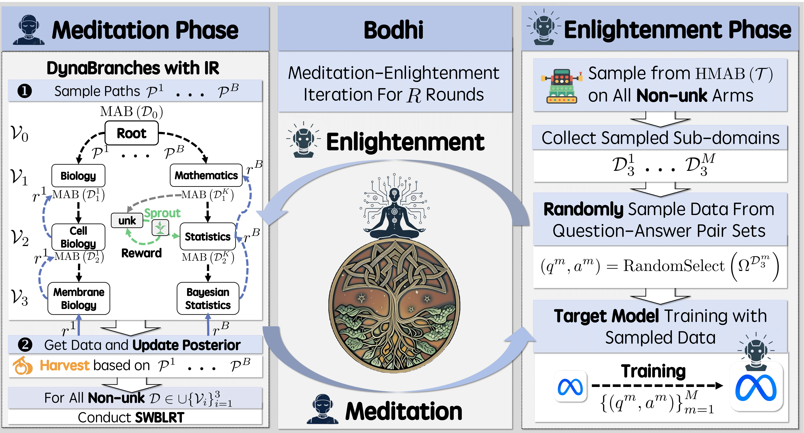

<div align="center">
   


🏆 **NeurIPS 2025 Main Conference Paper**  

[](https://arxiv.org/pdf/2506.15721v4)
[](https://huggingface.co/ChetKao)


_Junqi Gao <sup>1</sup>, Zhichang Guo <sup>1</sup>, Dazhi Zhang <sup>1</sup>, Dong Li <sup>1</sup>, Runze Liu <sup>3</sup>, Pengfei Li <sup>1,5</sup>, Kai Tian <sup>4</sup>, Biqing Qi<sup>2,†</sup>_

<sup>1</sup> _School of Mathematics, Harbin Institute of Technology_

<sup>2</sup> _Shanghai Artificial Intelligence Laboratory_

<sup>3</sup> _Tsinghua Shenzhen International Graduate School, Tsinghua University_

<sup>4</sup> _Department of Electronic Engineering, Tsinghua University_

<sup>5</sup> _Shanghai Innovation Institute_

_<sup>†</sup> Corresponding Author_




</div>

### 📄 Introduction 
Bohdi is a novel framework for heterogeneous Large Language Model (LLM) fusion that integrates the strengths of multiple source LLMs into a target LLM through adaptive knowledge exploration and automatic data generation. Unlike existing methods that rely on real data from limited domains and use fixed data allocation proportions, Bohdi dynamically adjusts sampling based on the target LLM's performance and generates data automatically through a hierarchical knowledge tree structure. This ensures comprehensive domain coverage and balanced capability enhancement without the need for real data.



### ✨ Features

🚀 **Synthetic-Data-Only Fusion**: Bohdi operates without relying on real data, making it highly efficient and versatile.

🌳 **Dynamic Domain Exploration**: Through the hierarchical knowledge tree and Sprout/Harvest operations, Bohdi explores new domains and generates data automatically.

🔄 **Adaptive Data Allocation**: The DynaBranches mechanism with IR ensures dynamic adjustment of data sampling proportions based on the target LLM’s capabilities.


### ⚙️ Installation

**Main Environment for Distillation**
```bash
conda env create -f environment_Bohdi.yaml
```
**Environment for Evaluation**
```bash
conda env create -f opencompass_env.yaml
```
**Preparation for Evaluation Suite**
```bash
# The version we used: opencompass 0.3.4
git clone https://github.com/open-compass/opencompass opencompass
cd [your project path]/opencompass
pip install -e .
```


### ⏳ Distillation Training

To train the target LLM using Bohdi, follow these steps:

1. **Prepare Source LLMs**: Ensure you have access to the source LLMs you want to fuse. If you want to follow our setup, please download the following models:
   ```Python
   # Source Models
   Qwen/Qwen2.5-14B-Instruct
   mistralai/Mistral-Small-24B-Instruct-2501
   microsoft/phi-4
   # Target Models
   meta-llama/Llama-3.2-3B-Instruct
   meta-llama/Llama-3.1-8B-Instruct
   Qwen/Qwen2.5-7B-Instruct
   google/gemma-2-9b-it
   ```
2. **Run Bohdi For Distillation**
Please first configure the relevant paths in `run_bohdi.sh` according to your actual paths, and then run:
   ```bash
   source activate bohdi
   cd [your project path]/Bohdi
   bash run_bohdi.sh
   ```

### 📏 Evaluation
We use <a href="https://github.com/open-compass/opencompass/tree/main">OpenCompass</a> for evaluation and perform inference based on VLLM. To evaluate your model, please configure the relevant paths in `eval_opencompass.sh` according to your actual paths, and then run:
```bash
source activate opencompass
cd [your project path]/opencompass
bash eval_opencompass.sh
```

### Direct Download and Usage
If you would like to directly use the distilled models for evaluation, our distilled models can be found directly on Hugging Face:
```Python
ChetKao/Bohdi-Llama-3.2-3B-Instruct
ChetKao/Bohdi-Llama-3.1-8B-Instruct
ChetKao/Bohdi-Qwen2.5-7B-Instruct
ChetKao/Bohdi-gemma-2-9b-it
```


### 📚 Citation
```
@article{gao2025bohdi,
  title={Bohdi: Heterogeneous LLM Fusion with Automatic Data Exploration},
  author={Junqi Gao and Zhichang Guo and Dazhi Zhang and Dong Li and Runze Liu and Pengfei Li and Kai Tian and Biqing Qi},
  journal={arXiv preprint arXiv:2506.15721},
  year={2025},
  url={https://doi.org/10.48550/arXiv.2506.15721}
}
```
